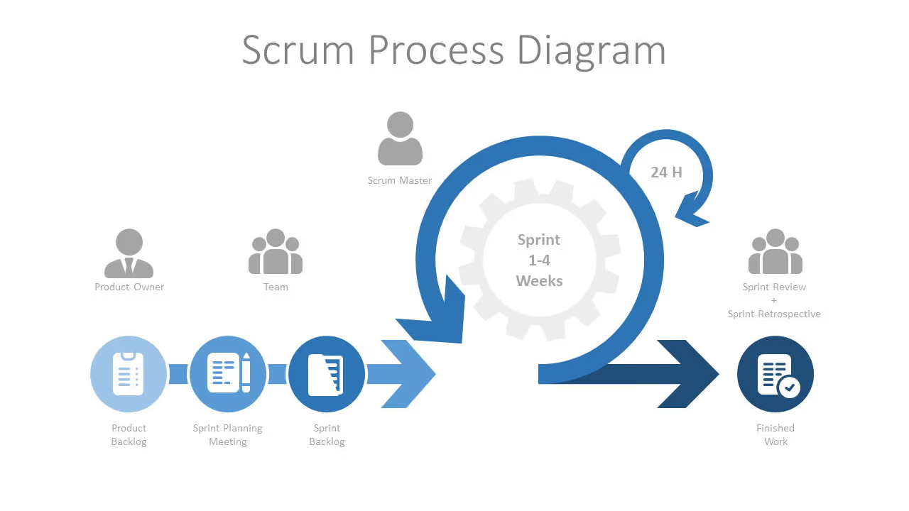

# Méthodologie Agile

L'agilité est un concept plus qu'une méthode en elle même. Plusieurs méthodes différentes de gestion de projet existent, et se basent sur de l'Agile.

L'agile est basé sur 12 principes, eux-même issus de 4 valeurs fondamentales :

- Les individus et leurs interactions, de préférence aux processus et aux outils,
- Des solutions opérationnelles, de préférence à une documentation exhaustive,
- La collaboration avec les clients, de préférence aux négociations contractuelles,
- La réponse au changement, de préférence au respect d’un plan.

Vous pouvez retrouver ces valeurs et principes sur ce lien : <a href="https://manifesteagile.fr/" target="_blank">Manifeste Agile</a>

L'agile englobe plusieurs méthodes et plusieurs outils ayant tous pour but à leur manière, de répondre aux valeurs et principes ci-dessus.

**Quelques méthodes** : 
- SCRUM
- Kanban
- Extreme Programming
- Lean Software Devlopment

**Quelques outils** : 
- Gestion de projet
- Kanban
- Communication
- Développement
- Documentation
- Tests

## SCRUM

## Les participants

- `Product Owner (PO)` : C'est le **responsable du produit** qui a pour objectif de **maximiser la valeur** de ce qui est développé.
- `Team` : C'est l'équipe de développement
- `Scrum Master` : C'est le garant de la méthodologie SCRUM.
- `Client` : C'est celui qui paye et donc qui décide.

*Note* : Ne pas confondre un `Product Owner` avec un `Chef de projet` qui est lui **responsable de la livraison** d'un produit, et a pour objectif de faire respecter **un planning, un périmètre et un budget**.

## La terminologie

### Product Backlog

Il s'agit de toutes les tâches à réaliser dans le projet, pour répondre à l'expression des besoins.

Ce backlog est renseigné au tout début du projet, mais peut évoluer au fil du temps.

Généralement, lors du démarrage d'un Backlog au sein d'une équipe, chaque personne se met en accord avec les autres sur : 

- `Definition of Ready (DoR)` : C'est une liste de critères qu’un élément du backlog doit respecter avant de pouvoir être pris en charge par l’équipe.
- `Definition of Done (DoD)` : C'est une liste de critères objectifs que le travail doit respecter pour être considéré comme terminé.

### Le Sprint

Un sprint est une période de travail **courte**, **fixe** et **répétée**. 

Il concerne la phase de production.

### Le Sprint Planning Meeting

C'est une réunion qu'on réalise à chaque début de sprint, et qui permet de définir ce qu'on va y faire.

### Le Sprint Backlog

C'est le backlog spécifique au sprint à réaliser.

### Le daily Meeting

C'est une réunion qui à lieue tous les jours, en début de journée. Elle doit être courte, 5 à 10 minutes maximum.

### Le Sprint Review

C'est la présentation du Sprint que l'on fait au client.

### Le Sprint Retrospective

C'est un retour d'expérience, qui permet de se poser sur les questions de ce qui s'est bien passé, ou pas.

Un format usuellement utilisé pour faire cette retrospective est : `Keep / Drop / Try`.

- `Keep` : Ce qu'on garde, qu'on ne change pas.
- `Drop` : Ce qu'on ne garde pas, qu'on jette.
- `Try` : Ce qu'on doit essayer, tester.

### Le découpage des fonctionnalités (organisation)

- `Epic` : C'est le nom qu'on donne à une grosse fonctionnalité. Souvent, elle est trop grosse pour être planifiée sur un seul sprint.
- `User Story` : C'est une fonctionnalité, plus petite que la Epic, qui peut être développée sur un seul sprint. Une Epic peut être consituée de plusieurs user stories.
- `Theme` : C'est le regroupement d'Epics ou / et de User Stories.

### Focus sur les User Stories

Le but est de reformuler un besoin (sous entendu une fonctionnalité) en langage humain, de telle sorte à ce qu'une seule interprétation soit possible.

Le format traditionnel d'une User Story est : 

`En tant que ....... je veux ....... afin de .......`

Chaque user Story doit théoriquement disposé de "critères d'acceptation". L'idée est de savoir quels critères minimums on doit remplir avant de considérer la User Story comme réalisée.

### Les autres termes

- `Planning Poker` : Le principe est d'évaluer la complexité des User Stories (US).
- `Sprint Goal` : L'objectif du sprint, à définir avant le début du sprint.
- `Tasks / Sub-tasks` : Tâches et sous-tâches, permettant de découper une User Story en plusieurs choses à faire.
- `Spikes` : Petites tâches, souvent exploratoires ou concernant du R&D.
- `Scrum Board`: Le tableau d'avancement du Sprint en cours uniquement (pas les autres !).

## Kanban

C'est une méthode de gestion du travail, souvent utilisée en agile, centrée sur la visualisation. Elle défend plusieurs objectifs :

- Visualiser le travail pour mieux le comprendre
- Limiter le nombre de tâches en cours (WIP)
- Fluidifier le flux de production
- Améliorer le délai de livraison (lead time)
- Favoriser l’amélioration continue

**Les colonnes de base dans un Kanban** : 

- Todo (A faire)
- Doing (En cours)
- Done (Fait)

Ces colonnes sont largements adaptables aux besoins des entreprises, et il n'est pas rare de voir des talbeaux à 10 ou 15 colonnes.
